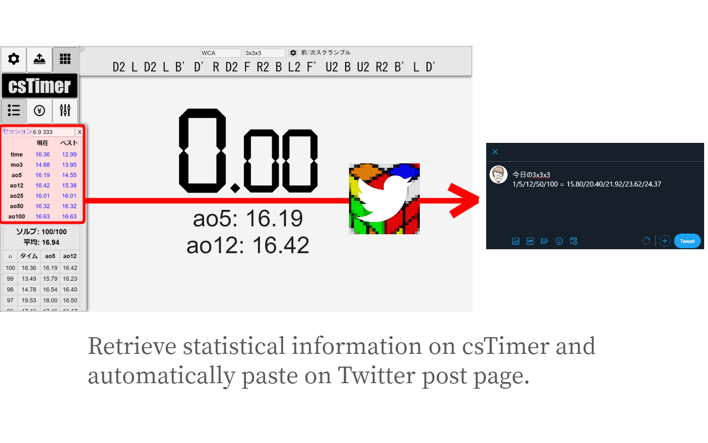
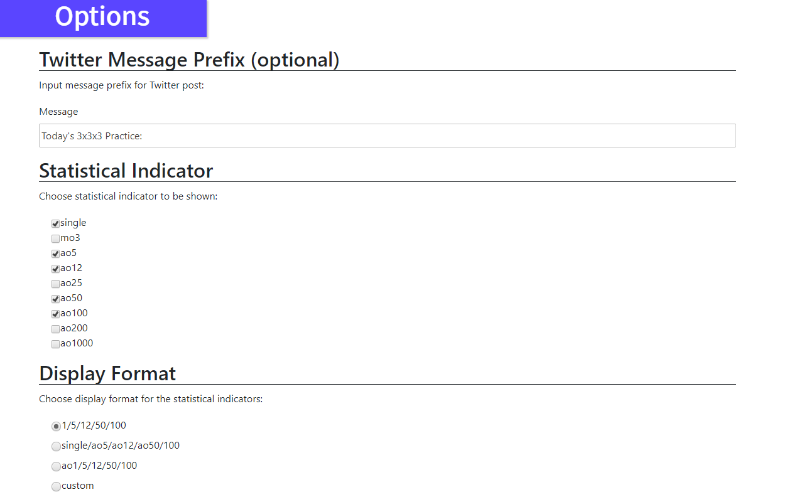
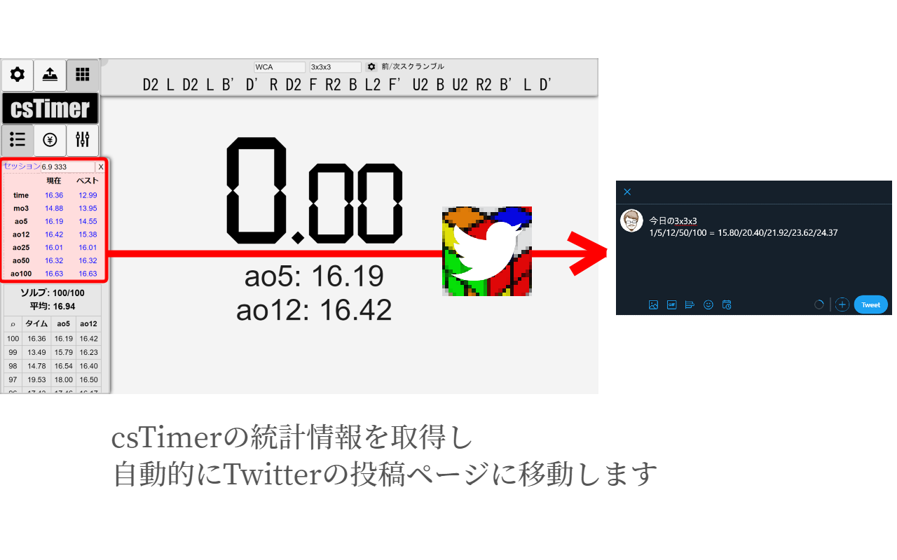
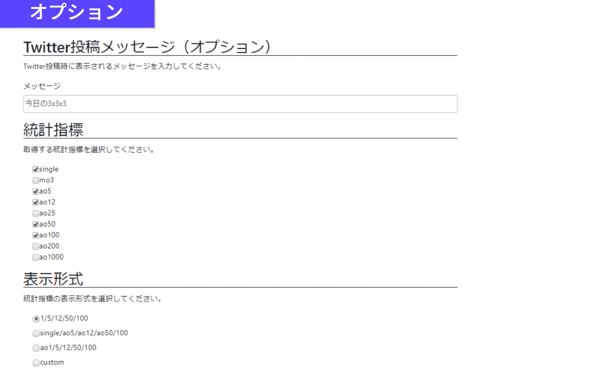

# cstimer-parse-to-tweet

This is Google Chrome extension for parsing csTimer statistics data and tweeting.

## What is this?
**You can tweet with your daily csTimer statistics (e.g, single, ao5, ao12, etc.) just by clicking the extention icon on Google Chrome.**



This extension automatically generates a text string like below:

```
Today's 3x3x3 practice:
1/5/12/50/100 = 15.80/20.40/21.92/22.30/23.62
```

you can customize:
- statistical indicators of times which appear in the output text
- prefix text before the times.



**Enjoy csTimer!**

## Disclaimers
- **This extension is under development. It might be defective.**

## How to install?
- Install on [Chrome Web Store](https://chrome.google.com/webstore/detail/cstimer-parse-to-tweet/gcbfbgcpjcphjboebngggcjmojjmegpo).
- For developmental use, you can install this extension locally from this repository via developer mode at your own risk.

## Release Notes
### 1.1 beta (2020/06/10)
- You can customize the format of the indicators as you like.
### 1.0 beta (2020/06/08)
- Published on Chrome Web Store.
- Implemented the basic features.
- Copy to the clipboard or not.

## Lisence
under MIT Lisence.

----
**（日本語）**

## これは何？
これはcsTimerの統計情報をパースしてTwitterに投稿するためのGoogle Chrome拡張機能です。**csTimerに表示された統計指標のうち、事前にオプションで指定された指標(例・Single、ao5、ao12、ao100など)のみを取得し、Twitterに投稿できます。**



次のようなテキストが自動的に生成され、Twitterの投稿ページに貼り付けられます。

```
今日の3x3x3
1/5/12/50/100 = 15.80/20.40/21.92/22.30/23.62
```

次の項目をカスタマイズできます。
- 取得する統計指標
- 統計指標の前に表示するテキスト(例・「今日の3x3x3」)
- クリップボードへのコピーの有無



**csTimerをお楽しみください！**

## 免責事項
- **この拡張機能は開発中です。動作しない場合がありますので、ご留意ください。**

## インストール方法
- [Chrome Web Store](https://chrome.google.com/webstore/detail/cstimer-parse-to-tweet/gcbfbgcpjcphjboebngggcjmojjmegpo)からインストールすることができます。
- デベロッパーモードでインストールして試すこともできます。個人の責任でどうぞ。人柱募集中。

## リリースノート
### 1.2 beta (2020/06/16)
- クリップボードへのコピー機能を追加しました。オプション画面からクリップボードへのコピーの有無を選択できます。また、Twitterへの投稿をせずにクリップボードへコピーだけすることもできます。
- 誤字を修正しました
### 1.1 beta (2020/06/10)
- 「1/5/12」などの表示形式を好みに合わせてカスタマイズすることができるようになりました。
### 1.0 beta (2020/06/08)
- Chrome Web Storeに公開しました
- 基本機能を実装しました

## ライセンス
MIT Lisence.
